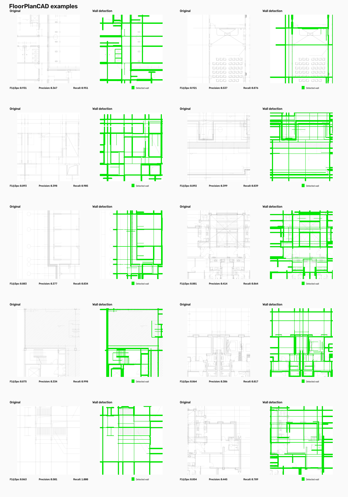
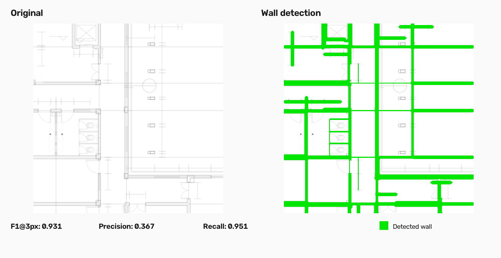
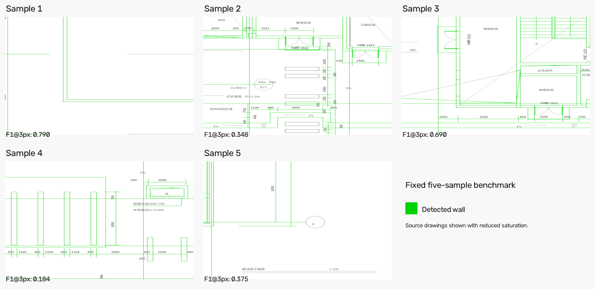
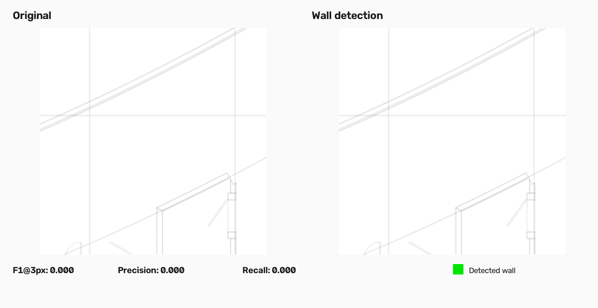

# PlanParse

PlanParse finds likely walls in architectural PDF drawings and exports their locations as structured data.

It works best when the PDF contains drawing lines that can be read directly from the PDF, but it can also attempt basic wall detection from clean image-based plans.

[**Live demo**](https://planparse-wall-extraction.streamlit.app/)



## Features

- Reads drawing lines stored directly in PDF files
- Uses the rendered page image as an additional wall signal
- Can detect wall-like structures from the rendered page when drawing lines are not available
- Joins broken line segments and removes duplicate detections
- Lets you view the lines and wall candidates found during detection
- Exports detected walls as JSON
- Includes an interactive Streamlit demo

## How it works

PlanParse supports three detection methods.

```text
                        PDF page
                           │
              ┌────────────┴────────────┐
              │                         │
      read PDF drawing lines       render page image
              │                         │
      find parallel line pairs    find long line shapes
              │                         │
              ├──────────┐  ┌───────────┤
              │          │  │           │
           Vector      Hybrid        Raster
              │           │            │
              └───────────┴─────┬──────┘
                                │
                         remove duplicates
                                │
                          export results
```

### Vector detection

Vector mode uses drawing lines stored directly in the PDF.

1. Read straight line segments from the PDF.
2. Join nearby segments that belong to the same line.
3. Look for parallel, overlapping line pairs that could be the two sides of a wall.
4. Remove duplicate detections and keep the stronger candidates.

### Raster detection

Raster mode works only from the rendered page image.

1. Render the page as an image.
2. Separate drawing marks from the background.
3. Use horizontal and vertical image filters to keep long line structures.
4. Convert those structures into line segments.
5. Look for parallel line pairs and score them as possible walls.

Raster mode works best on clean, mostly horizontal/vertical floor plans and can produce many false positives on complex drawings.

### Hybrid detection

Hybrid mode combines both sources. It first finds wall candidates from the PDF drawing lines, then uses the rendered page image to check how strongly each candidate is supported before producing the final result.

## Detection modes

| Mode | What it uses | Best suited for |
|---|---|---|
| **Vector** | Drawing lines stored in the PDF | Clean vector drawings where image support is not needed |
| **Raster** | Rendered page image only | Clean image-based or scanned plans |
| **Hybrid** | PDF drawing lines + rendered page image | Vector PDFs where both drawing geometry and image evidence are useful |

## Demo

The [Streamlit demo](https://planparse-wall-extraction.streamlit.app/) lets you:

- upload a PDF or use the built-in example
- choose a page
- select the detection mode
- compare the original drawing with detected walls
- inspect intermediate stages
- adjust the overlay
- export results as JSON

Uploads are limited to 20 MB.

## Example

Detected walls are highlighted in green.



## Evaluation

### PDF detection modes

A small five-drawing test uses original FloorPlanCAD vector drawings converted to vector-preserving PDFs. The same drawings are tested with all three detection methods.

| Method | IoU | Precision | Recall | F1@3px | Chamfer ↓ |
|---|---:|---:|---:|---:|---:|
| **Vector** | 0.015 | 0.015 | **0.761** | 0.148 | 244.75 |
| **Raster** | **0.025** | **0.026** | 0.612 | **0.229** | **233.76** |
| **Hybrid** | 0.024 | 0.024 | 0.522 | 0.194 | 244.21 |

Raster performed best on this small test set. Vector detection recovered more wall regions but also produced many more false positives. Hybrid reduced some of those false positives, but did not outperform Raster overall.

Hybrid currently fails when non-wall CAD geometry such as dimensions, borders and annotation lines looks similar to wall boundaries; a likely next step is to add stronger semantic or graph-based filtering so connected drawing elements can be classified in context.

This test contains only five drawings and should be treated as a sanity check rather than a broad accuracy estimate.


### Raster mode - Algorithm comparison

This separate five-drawing benchmark compares image-based wall detection methods using FloorPlanCAD wall masks. It does not evaluate Vector or Hybrid mode.

| Method | IoU | F1@3px | Chamfer ↓ |
|---|---:|---:|---:|
| **Classical raster baseline** | **0.182** | **0.477** | 99.28 |
| Original CubiCasa | 0.113 | 0.391 | **88.83** |
| CubiCasa partial fine-tune | 0.117 | 0.408 | 82.20 |
| Binary 512 px fine-tune | 0.000 | 0.000 | 1000.00 |



The classical raster baseline performed best on this fixed raster benchmark and does not require a neural-network runtime dependency.

### Raster mode - Issues

The raster-only modee was also tested separately on clean and realistic rasterized plans.

- A simple clean raster floor plan produced recognizable major walls.
- Five realistic rasterized construction pages produced many false positives from dimensions, borders, title blocks and other line structures.
- Raster mode is therefore most useful on clean, simple image-based plans.

## Experiments that were not adopted

Several alternatives were tested before freezing the current detector.

| Experiment | Result | Why it was not used | Possible next step |
|---|---|---|---|
| **Pretrained CubiCasa** | F1@3px 0.391 | The model transferred poorly from its original training data (CubiCasa5K) to FloorPlanCAD line drawings. | Fine-tune a segmentation model on a larger matched wall dataset. |
| **Partial CubiCasa fine-tune** | F1@3px 0.408 | Improved over the pretrained model but remained below the classical raster baseline. | Unfreeze more of the network and train on substantially more matched data. |
| **Binary 512 px wall head** | F1@3px 0.000 | The small binary head did not learn a useful wall representation under the limited training setup. | Train a dedicated segmentation network end-to-end rather than adapting a very small head. |
| **Stroke width / connectivity / wall-spacing rules** | Weak separation | Wall and non-wall drawing lines had heavily overlapping geometric distributions. Simple global thresholds were unreliable. | Use richer local context or learned graph features rather than more fixed thresholds. |
| **Random Forest candidate filter** | Improved some drawings but failed to generalize reliably | On an independent 25-drawing test it produced no output on 16/25 samples and degraded more samples than it improved. | Train on a larger and more varied set, or use a model that reasons over groups of connected drawing elements. |

These experiments are kept as development logs and are not runtime dependencies.

## Failure case

Some drawings produce little or no useful wall response.



## Limitations

- Dimension lines, tables and other parallel drawing elements can be mistaken for walls.
- Raster-only detection is reliable mainly on clean, simple plans.
- Curved and filled wall styles are only partly supported.
- Complex sheets with several plans, schedules or detail regions are not fully separated automatically.
- Wall detection is geometric rather than semantic; the system does not understand building elements in the way a BIM model does.
- Current independent test sets are small and should be treated as sanity checks rather than broad accuracy estimates.

## Output

Detected walls can be exported as JSON containing information such as:

```text
centerline
estimated thickness
confidence
source
```

The source identifies whether the result came from Vector, Raster or Hybrid detection.

## Setup

```bash
python -m venv .venv
source .venv/bin/activate
pip install -r requirements.txt
streamlit run app.py
```

## Data

Train Data
The fixed raster benchmark is reconstructed from the [Voxel51 FloorPlanCAD mirror](https://huggingface.co/datasets/Voxel51/FloorPlanCAD). Downloaded samples are not included in the repository.

The vector-aware benchmark uses original FloorPlanCAD SVG drawings converted to vector-preserving PDFs.

5 - image Test Data

Public construction drawing sources and attribution are listed in [`examples/public_examples.json`](examples/public_examples.json).

```bash
python download_benchmark.py
python benchmark.py
python download_examples.py
python run_examples.py
```

The CubiCasa experiments use the [CubiCasa5K repository](https://github.com/CubiCasa/CubiCasa5k). PyTorch and the CubiCasa model are not required to run the Streamlit app.

## License

PlanParse code is MIT licensed. External drawings and datasets remain under their original licenses and attribution requirements.
