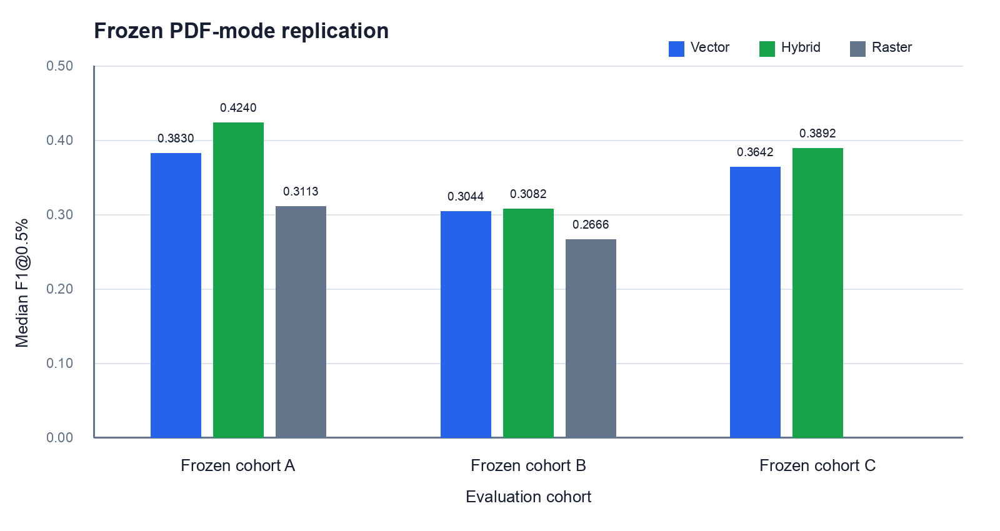

# PlanParse

PlanParse finds likely walls in architectural PDF drawings and exports their locations as structured data.

It works best when the PDF contains drawing lines that can be read directly from the PDF, but it can also attempt basic wall detection from clean image-based plans.

## [▶ Live Demo (Streamlit app)](https://planparse-wall-extraction.streamlit.app/)


## Features

- Reads drawing lines stored directly in PDF files
- Uses the rendered page image as an additional wall signal
- Can detect wall-like structures from rendered pages when drawing lines are not available
- Joins broken line segments and removes duplicate detections
- Lets you view lines and wall candidates found during detection
- Exports detected walls as JSON
- Includes an interactive Streamlit demo

## How it works

PlanParse supports three detection methods.

```text
                        PDF page
                           │
              ┌────────────┴────────────┐
              │                         │
      read PDF drawing lines       render page image
              │                         │
      find parallel line pairs    find long line shapes
              │                         │
              ├──────────┐  ┌───────────┤
              │          │  │           │
           Vector      Hybrid        Raster
              │           │            │
              └───────────┴─────┬──────┘
                                │
                         remove duplicates
                                │
                          export results
```


### Vector detection

Vector mode reads native PDF drawing geometry. It is useful for digitally generated PDFs and has high wall recall, but non-wall line structures can also be included. Method is:

1. Read straight line segments from the PDF.
2. Join nearby segments that belong to the same line.
3. Look for parallel, overlapping line pairs that could be the two sides of a wall.
4. Remove duplicate detections and keep the stronger candidates.

### Raster detection

Raster mode renders the page and uses image-space processing. It is useful when usable native vector information is absent, but it is more sensitive to visual clutter.  Method is:

1. Render the page as an image.
2. Separate drawing marks from the background.
3. Use horizontal and vertical image filters to keep long line structures.
4. Convert those structures into line segments.
5. Look for parallel line pairs and score them as possible walls.

### Hybrid detection

Hybrid mode combines native PDF geometry with raster evidence. It is the current recommended/default mode and had the highest replicated median F1@0.5% across the three frozen compatible evaluation cohorts.

## Detection modes

| Mode | What it uses | Best suited for |
|---|---|---|
| **Vector** | Drawing lines stored in the PDF | Clean vector drawings where image support is not needed |
| **Raster** | Rendered page image only | Clean image-based or scanned plans |
| **Hybrid** | PDF drawing lines + rendered page image | Vector PDFs where both drawing geometry and image evidence are useful |

## Demo

The [Streamlit demo](https://planparse-wall-extraction.streamlit.app/) lets you:

- upload a PDF or use the built-in example
- choose a page
- select the detection mode
- compare the original drawing with detected walls
- inspect intermediate stages
- adjust the overlay
- export results as JSON

Uploads are limited to 20 MB.

## Example

Detected walls are highlighted in green.


## Evaluation

### PDF detection modes

The current benchmark uses three pairwise-disjoint frozen cohorts. Vector and Hybrid span all three cohorts; Raster spans two.

| Mode | Frozen drawings | Median F1@0.5% |
|---|---:|---:|
| **Vector** | 150 | 0.3566 |
| **Raster** | 100 | 0.2855 |
| **Hybrid** | 150 | 0.3820 |

Hybrid had the highest median F1@0.5% in all three compatible cohorts. Vector retained greater recall. The [consolidated benchmark details](benchmark/README.md) include the full metric table and cohort comparisons.



### Raster mode - Issues

Raster-only detection is most useful on clean, simple image-based plans. Dimensions, borders, title blocks and other line structures can create false positives on realistic construction sheets.

## Experiments that were not adopted

* CubiCasa fine-tuning — Adapted CubiCasa toward wall-only prediction. The direct fine-tunes did not improve the pretrained baseline; a dedicated binary wall decoder improved semantic accuracy but remained well below the PDF geometry methods.
* Semantic candidate filtering — Used the CubiCasa variants to reject geometric candidates that did not look like walls in the rendered drawing. Fixed score thresholds were unstable across datasets, and ranking candidates relative to others on the same page did not improve fresh held-out data.
* Geometric context filtering — Scored candidates using simple adjacency and perpendicular-neighbor relationships. The added context did not produce a repeatable gain over the existing geometry pipeline.

These alternatives remain research references rather than runtime modes; see the [experiment notes](experiments/README.md) for more info.

## Failure case

Some drawings produce little or no useful wall response.


## Limitations

Recurring failure classes include:

- parallel non-wall geometry, including dimensions and borders
- title blocks and annotations/text
- furniture and symbols
- thin or fragmented walls
- complex curves and mixed sheets with several drawing regions

Wall detection is geometric rather than semantic; the system does not understand building elements in the way a BIM model does. Raster-only detection is mainly reliable on clean, simple plans.

## Output

Detected walls can be exported as JSON containing information such as:

```text
centerline
estimated thickness
confidence
source
```

The source identifies whether the result came from Vector, Raster or Hybrid detection.

## Setup

```bash
python -m venv .venv
source .venv/bin/activate
pip install -r requirements.txt
streamlit run app.py
```

## Data

The fixed raster benchmark is reconstructed from the [Voxel51 FloorPlanCAD mirror](https://huggingface.co/datasets/Voxel51/FloorPlanCAD). Downloaded samples are not included in the repository.

The vector-aware benchmark uses original FloorPlanCAD SVG drawings converted to vector-preserving PDFs.

Public construction drawing sources and attribution are listed in [`examples/public_examples.json`](examples/public_examples.json).

```bash
python download_benchmark.py
python benchmark.py
python download_examples.py
python run_examples.py
```

The CubiCasa experiments use the [CubiCasa5K repository](https://github.com/CubiCasa/CubiCasa5k). PyTorch and the CubiCasa model are not required to run the Streamlit app.

## License

PlanParse code is MIT licensed. External drawings and datasets remain under their original licenses and attribution requirements.
