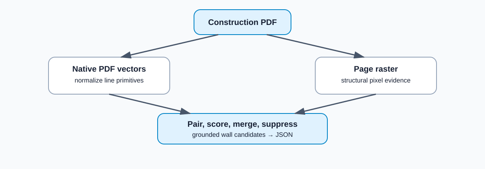

# PlanParse

PlanParse extracts candidate wall geometry from construction PDFs using native PDF vector primitives and raster structural cues.


## Features

- PDF vector extraction with PyMuPDF
- raster/vector coordinate alignment
- parallel-line wall candidate detection
- collinear merging and duplicate suppression
- page diagnostics
- JSON geometry export
- Streamlit visualization

## Pipeline



```text
PDF
 ├── vectors → line normalization → candidate pairing ──┐
 └── raster  → structural response ─────────────────────┤
                                                        ↓
                                                score / merge
                                                        ↓
                                                  wall geometry
```

The pipeline renders one page, extracts line primitives, merges near-collinear fragments, pairs approximately parallel lines, scores raster support, suppresses duplicates, and exports wall centerlines with source path IDs.

## Demo

```bash
python -m venv .venv
source .venv/bin/activate
pip install -r requirements.txt
streamlit run app.py
```

The Streamlit interface supports a built-in synthetic vector PDF, PDF upload, page selection, raw-vector and candidate overlays, opacity control, diagnostics, and JSON export. Pages render at approximately 150 DPI with a 2,500 px maximum dimension. Uploads are limited to 20 MB.

## Example

Detected wall regions are highlighted in green.


## Evaluation

The five-sample raster sanity benchmark is separate from the PDF-vector task because it labels CAD wall regions while PlanParse outputs paired-line centerlines and estimated thickness.

| Method | IoU | F1@3px | Chamfer ↓ |
|---|---:|---:|---:|
| Morphology | 0.182 | 0.477 | 99.28 |
| Original CubiCasa | 0.113 | 0.391 | 88.83 |
| 44-head fine-tune | 0.117 | 0.408 | 82.20 |
| Binary-512 fine-tune | 0.000 | 0.000 | 1000.00 |


## Failure case

Some drawings produce little or no wall response.


## Limitations

- Parallel-line heuristics produce false positives on dimensions and diagram geometry.
- Raster-only PDFs do not provide native wall geometry.
- Filled and curved wall representations are only partially supported.
- Page-region isolation is heuristic.
- The FloorPlanCAD benchmark contains five fixed samples.

## Setup

```bash
python -m venv .venv
source .venv/bin/activate
pip install -r requirements.txt
streamlit run app.py
```

## Data

The benchmark downloader reconstructs the fixed five-sample set from the [Voxel51 FloorPlanCAD mirror](https://huggingface.co/datasets/Voxel51/FloorPlanCAD). Public construction drawing sources and attribution are listed in [`examples/public_examples.json`](examples/public_examples.json). Downloaded samples are not included in the repository.

```bash
python download_benchmark.py
python benchmark.py
python download_examples.py
python run_examples.py
```

The CubiCasa evaluation uses the [CubiCasa5K repository](https://github.com/CubiCasa/CubiCasa5k). Its PyTorch implementation and training artifacts are not dependencies of the Streamlit interface.

See [`experiments/README.md`](experiments/README.md) for the concise semantic-model experiment result.

## License

PlanParse code is MIT licensed. External drawings and datasets remain under their original licenses and attribution requirements.
