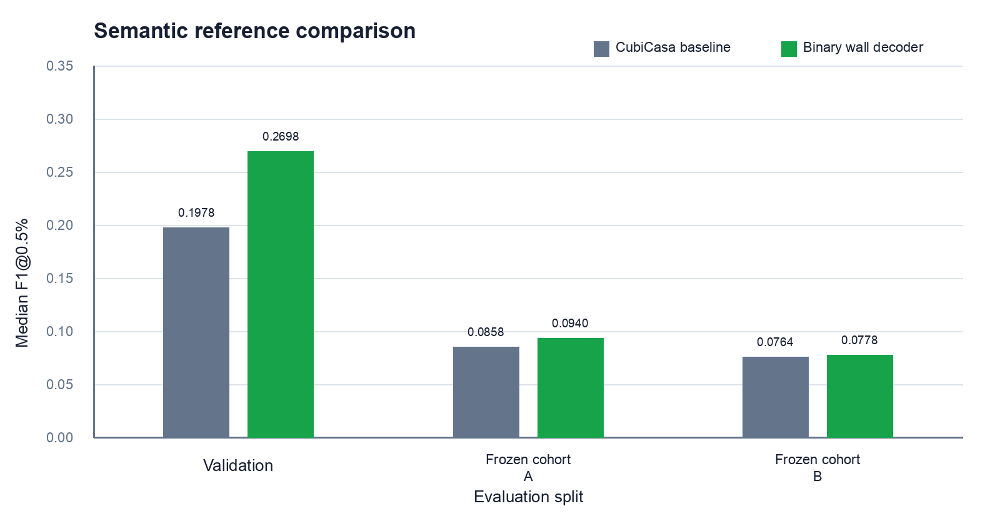

# Experiment Notes

These experiments test learned wall prediction and candidate filtering as possible additions to the PDF geometry pipeline. None are part of the released Vector/Raster/Hybrid inference path.

The learned-model results below are reported separately from the main PDF benchmark because they evaluate image-based wall prediction rather than the released PDF detection modes.

## Learned wall prediction

### CubiCasa baseline

The pretrained CubiCasa model provides the reference for the learned wall-prediction experiments. No PlanParse-specific weights were trained for this baseline.

Validation median F1@0.5%: **0.1978**

### Wall-class fine-tune

CubiCasa already includes a wall class among its outputs. This experiment fine-tuned that existing class using the FloorPlanCAD wall masks, without replacing the original output structure.

Validation median F1@0.5%: **0.1973**, compared with 0.1978 for the pretrained CubiCasa model. The fine-tune therefore provided no measurable improvement.

### Wall-vs-rest fine-tune

Reused CubiCasa’s existing multi-class segmentation head, but trained its outputs as a binary wall-versus-nonwall prediction.

Validation median F1@0.5%: **0.1831**

Performance decreased relative to the pretrained model, so this approach was not kept.

| Semantic method | Validation median F1@0.5% |
|---|---:|
| CubiCasa baseline | 0.1978 |
| Wall-class fine-tune | 0.1973 |
| Wall-vs-rest fine-tune | 0.1831 |

### Binary wall decoder

A dedicated wall decoder was added on top of CubiCasa image features instead of relying on the original semantic output head.

This produced the clearest improvement in the learned-wall experiments. Validation median F1@0.5% increased from **0.1978** to **0.2698**. The improvement also appeared on two independent frozen final cohorts, although absolute performance remained well below the PDF geometry modes.

| Method | Validation median F1@0.5% | Combined frozen-final median F1@0.5% |
|---|---:|---:|
| CubiCasa baseline | 0.1978 | 0.0773 |
| Binary wall decoder | 0.2698 | 0.0848 |

Combined final paired outcome: 51 improved, 28 degraded, 8 tied. This supports a relative semantic improvement over the CubiCasa baseline, not a claim that the semantic model outperforms the PDF geometry modes.

## Filtering geometry with learned wall predictions

### Fixed prediction threshold

Each geometric wall candidate was assigned a wall score from the rendered drawing. Candidates below a fixed score were removed.

The score distribution shifted substantially between datasets, so a threshold selected on one set did not transfer reliably to another. The development and final datasets also used different wall-target construction paths, preventing a clean cross-dataset comparison.

This method was not adopted.

### Within-page candidate ranking

Candidates were ranked against other candidates from the same drawing rather than compared with one fixed score threshold.

This reduced dependence on the model's absolute score scale and passed the internal validation check. After the method was frozen, however, it did not improve the fresh final cohort.

It was therefore not added to the runtime pipeline.

## Geometric context filtering

Simple local structure around each wall candidate was added to the candidate score, including nearby connections, perpendicular lines and adjacency to other candidates.

These cues were intended to distinguish wall networks from isolated dimensions, borders and other parallel structures. They did not produce a repeatable improvement over the existing geometry pipeline.

The experiment only tested lightweight local relationships and should not be interpreted as a full topology or room-boundary model.

## Summary

| Experiment | What was tested | Result |
|---|---|---|
| **CubiCasa baseline** | Pretrained image-based wall prediction | Reference |
| **Wall-class fine-tune** | Fine-tune the existing wall output | No improvement |
| **Wall-vs-rest fine-tune** | Train walls against all non-wall classes | Worse than baseline |
| **Binary wall decoder** | Add a dedicated wall-specific decoder | Improved learned prediction, still below PDF geometry |
| **Fixed prediction threshold** | Remove geometry candidates with low wall scores | Did not transfer reliably between datasets |
| **Within-page candidate ranking** | Remove candidates that rank weakly within the same drawing | No improvement on fresh final data |
| **Geometric context filtering** | Use nearby connections and perpendicular lines | No repeatable gain |

## Current status

The released inference pipeline remains Vector, Raster and Hybrid, with Hybrid as the recommended default.

The learned wall predictor and candidate-filtering experiments remain documented references rather than runtime modes.
